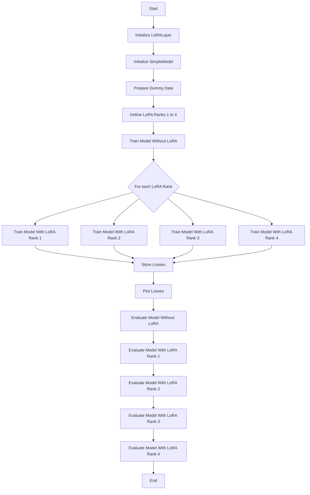

<h1 align="center">LoRA</h1>

Finetuning is a necessary in order to give a pretrained large language model (LLM) a particular focus such that it able to carry out a particular task in desirable way.  
But finetuning large-scale models involves updating billions of parameters which extremely expensive in terms of the memory and time requirements. For this reason a number of techniques have been suggested which reduces the memory footprint of full parameter finetunin without cmpromising on the model quality. A popular fine-tuning method that addresses the challenges of full-parmeter fine tuning is Low-Rank Adaption by Hu et al. (2021).

### Diagram for LoRA_01.ipynb

