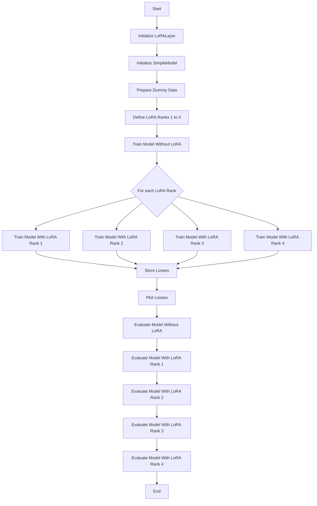

<h1 align="center">LoRA</h1>

Fine-tuning is necessary to give a pretrained large language model (LLM) a particular focus such that it is able to carry out a specific task in a desirable way. 
However, fine-tuning large-scale models involves updating billions of parameters, which is extremely expensive in terms of memory and time requirements. 
To address this issue, several techniques have been proposed to reduce the memory footprint of full parameter fine-tuning without compromising model quality. 
A popular fine-tuning method that addresses the challenges of full-parameter fine-tuning is Low-Rank Adaptation (LoRA) by Hu et al. (2021).

The Colab notebook `LoRa_01.ipynb` introduces a simple way to carry out Low-Rank Adaptation using dummy data. It trains and evaluates models with and without Low-Rank Adaptation for ranks 1 to 4, plots the training losses for comparison, and prints sample predictions to illustrate the effect of different LoRA ranks.

A weight matrix in the context of LLMs is usually denoted as $W \in \mathbb{R}^{m \times n}$. 
In our example, the weight matrix is $W \in \mathbb{R}^{10 \times 5}$ which is simply a $10 \times 5$ matrix of real numbers. 
Its full rank $d$ is $\min(10, 5) = 5$. 
The question that this example program seeks to answer is whether a lower-rank adaptation of the weight matrix will result in approximately equal performance compared to the full rank. Against this background, the program can be described as follows:

- **Imports and Initialization**
  - The program imports necessary libraries: `torch`, `torch.nn`, `torch.optim`, and `matplotlib.pyplot`.
  - It defines a custom `LoRALayer` class, which implements the Low-Rank Adaptation (LoRA) mechanism by decomposing the weight matrix into two lower-rank matrices (Hu et al. (2021, p. 4).
  - A `SimpleModel` class is defined, which uses either a regular linear layer or a LoRA layer depending on the provided rank.

- **Data Preparation**
  - Dummy input and target data are generated using random tensors. The input dimension is set to 10 and the output dimension to 5.

- **Training and Evaluation Functions**
  - `train_model` function: This trains a given model using Mean Squared Error (MSE) loss and Adam optimizer for a specified number of epochs.
    It returns the list of training losses.
  - `evaluate_model` function: This evaluates the model on test inputs and prints the predictions.

- **Model Training Without LoRA**
  - A simple linear model without LoRA is trained using the dummy data, and the training losses are stored.

- **Model Training With LoRA**
  - The program trains separate models with LoRA ranks 1, 2, 3, and 4. Each model's training losses are stored.

- **Loss Plotting**
  - The program plots the training losses for all models (with and without LoRA) for comparison.

- **Evaluation**
  - Finally, the program evaluates and prints predictions from the trained models (with and without LoRA) using new test inputs.

### Diagram for LoRA_01.ipynb

