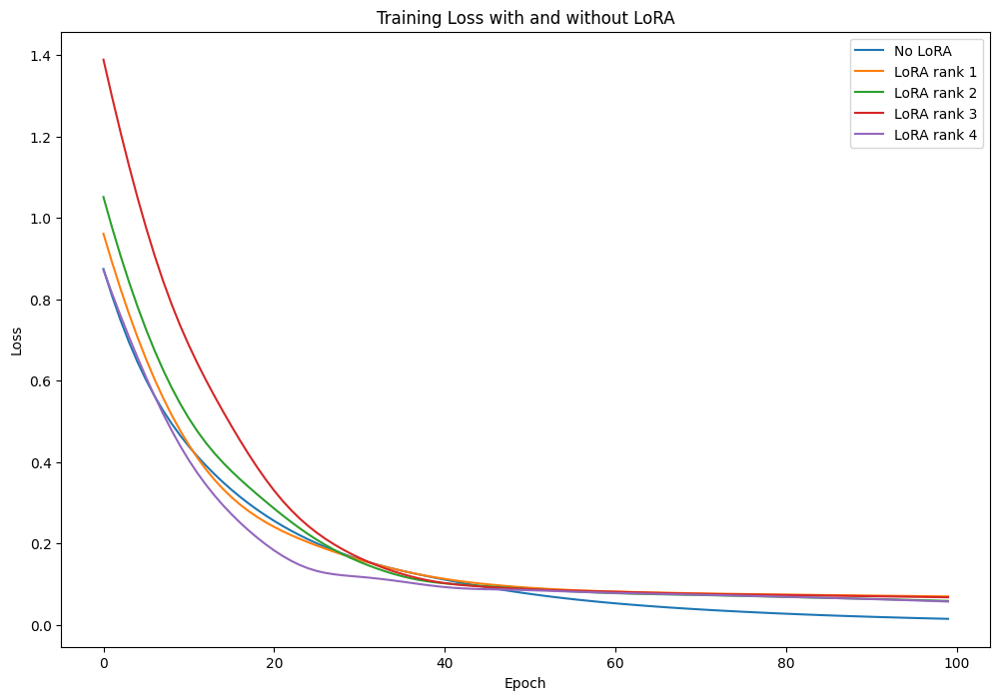

<h1 align="center">LoRA</h1>

Fine-tuning is essential for adapting a pretrained large language model (LLM) to perform specific tasks effectively. However, fine-tuning large-scale models may involve updating billions of parameters and is therefore highly demanding in terms of memory and time. To address this, parameter-efficient fine-tuning (PEFT) methods have been developed. These methods reduce the memory and execution time required for full parameter fine-tuning while maintaining model quality.

A notable PEFT method is Low-Rank Adaptation (LoRA) by Hu et al. (2021). LoRA addresses the challenges of full-parameter fine-tuning by updating only two smaller, lower-rank matrices instead of the original large weight matrix. 
The final weights are obtained by adding the LoRA-adapted weights to the original matrix. LoRA has set a paradigm for efficient fine-tuning, inspiring numerous variations. 

The Colab notebook `LoRa_01.ipynb` introduces a simple way to carry out Low-Rank Adaptation using dummy data. It trains and evaluates models with and without Low-Rank Adaptation for ranks 1 to 4, plots the training losses for comparison, and prints sample predictions to illustrate the effect of different LoRA ranks.

A weight matrix in the context of LLMs is usually denoted as $W \in \mathbb{R}^{m \times n}$. 
In our example, the weight matrix is $W \in \mathbb{R}^{10 \times 5}$ which is simply a $10 \times 5$ matrix of real numbers. 
Its full rank $d$ is $\min(10, 5) = 5$. 
The question that this example program seeks to answer is whether a lower-rank adaptation of the weight matrix will result in approximately equal performance compared to the full rank. Against this background, the program can be described as follows:

- **Imports and Initialization**
  - The program imports necessary libraries: `torch`, `torch.nn`, `torch.optim`, and `matplotlib.pyplot`.
  - It defines a custom `LoRALayer` class, which implements the Low-Rank Adaptation (LoRA) mechanism by decomposing the weight matrix into two lower-rank matrices (Hu et al. (2021, p. 4).
  - A `SimpleModel` class is defined, which uses either a regular linear layer or a LoRA layer depending on the provided rank.

- **Data Preparation**
  - Dummy input and target data are generated using random tensors. The input dimension is set to 10 and the output dimension to 5.

- **Training and Evaluation Functions**
  - `train_model` function: This trains a given model using Mean Squared Error (MSE) loss and Adam optimizer for a specified number of epochs.
    It returns the list of training losses.
  - `evaluate_model` function: This evaluates the model on test inputs and prints the predictions.

- **Model Training Without LoRA**
  - A simple linear model without LoRA is trained using the dummy data, and the training losses are stored.

- **Model Training With LoRA**
  - The program trains separate models with LoRA ranks 1, 2, 3, and 4. Each model's training losses are stored.

- **Loss Plotting**
  - The program plots the training losses for all models (with and without LoRA) for comparison.

- **Evaluation**
  - Finally, the program evaluates and prints predictions from the trained models (with and without LoRA) using new test inputs.


### Diagram for LoRA_01.ipynb

```mermaid
graph TD
    A[Start] --> B[Initialize LoRALayer]
    B --> C[Initialize SimpleModel]
    C --> D[Prepare Dummy Data]
    D --> E[Define LoRA Ranks 1 to 4]
    E --> F[Train Model Without LoRA]
    F --> G{For each LoRA Rank}
    G --> H[Train Model With LoRA Rank 1]
    G --> I[Train Model With LoRA Rank 2]
    G --> J[Train Model With LoRA Rank 3]
    G --> K[Train Model With LoRA Rank 4]
    H --> L[Store Losses]
    I --> L
    J --> L
    K --> L
    L --> M[Plot Losses]
    M --> N[Evaluate Model Without LoRA]
    N --> O[Evaluate Model With LoRA Rank 1]
    O --> P[Evaluate Model With LoRA Rank 2]
    P --> Q[Evaluate Model With LoRA Rank 3]
    Q --> R[Evaluate Model With LoRA Rank 4]
    R --> S[End]
```


### Example of a full rank matrix (d=5) and the low-rank matrices A and B (r=4)

Full-rank weight matrix (W): 
````{verbatim}
tensor([[-0.0448,  0.2058, -0.0281,  0.0376,  0.0584,  0.1400, -0.2718, -0.2713,  0.3039,  0.1259],
        [-0.2664, -0.1778, -0.1396,  0.1138, -0.0749,  0.3648, -0.2606,  0.5835,  0.2209, -0.2050],
        [ 0.0892,  0.2565,  0.1543, -0.0356, -0.0429,  0.4232, -0.0238,  0.1769,  0.0168,  0.0441],
        [ 0.2019,  0.0651, -0.0648,  0.0958,  0.1941, -0.1589, -0.0211,  0.0678,  0.2127, -0.0174],
        [ 0.0487, -0.0314,  0.2424,  0.3472, -0.1243, -0.1546,  0.2496,  0.3454,  0.0283, -0.1404]])

Low-rank weight matrix A:

tensor([[ 0.1320,  0.0891, -0.0908, -0.0657,  0.1354, -0.3377, -0.0904, -0.0050,  0.2353,  0.4216],
        [ 0.4328,  0.1273, -0.1969,  0.1918,  0.1469,  0.2975, -0.3079, -0.3059,  -0.3676, -0.1955],
        [ 0.4405,  0.1213, -0.1199,  0.3663,  0.0338,  0.2299, -0.0117,  0.1059,  -0.3072, -0.1316],
        [ 0.3890,  0.2118, -0.1320,  0.3370,  0.0558,  0.1938, -0.0376, -0.2561,  -0.3457, -0.0760]])

Low-rank weight matrix B:

tensor([[ 0.3414, -0.2377, -0.2392, -0.2219],
        [-0.2382,  0.3772,  0.1774, -0.0076],
        [-0.0715,  0.2588,  0.2680,  0.2750],
        [ 0.1021,  0.3189,  0.3937,  0.3194],
        [-0.1458, -0.3615, -0.0903, -0.2763]])
````


### Evaluation
The evaluation results are shown in the Figure below. 
It shows that low-rank matrices can approximate the full rank matrix of weights reasonably well or even good. 
However, a combination of a small number of epochs and a very low value for r is most likely to lead to a reduced model quality. 




