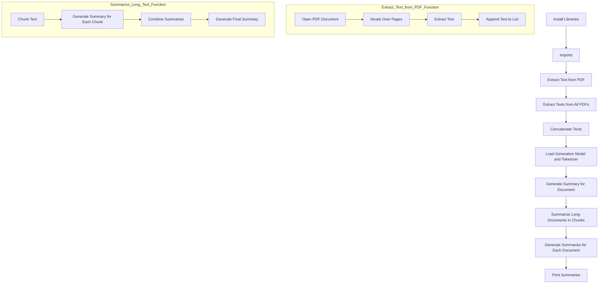

<h1 align="center">RAG</h1>

Retrieval-Augmented Generation (RAG)  combines retrieval of relevant information, e.g., from pdf files, from the Web etc with generative models to create coherent and contextually rich responses. In this way RAG, injects operational knowledge into a pretrained large language model which has not been part of its training. 
The Colab notebook `rag_01.ipynb` introduces a simple RAG pipeline.  Its essential processing steps are: 

* Information Retrieval: Using the PyMuPDF library the code first extracts text from PDF files. It concatenates the text from all pages of each PDF file into a single string (eg., full_text_1, full_text_2 etc.). This step corresponds to the information retrieval component of RAG, where relevant information is retrieved from the documents.

* Chunking: The code then splits the long text into smaller chunks (text_chunks) of a specified size (chunk_size=512). This chunking step is necessary because large language models like T5 have a limited input length due to computational constraints.
  
* Language Generation: For each chunk, the code uses a pre-trained T5 language model (AutoModelForSeq2SeqLM) to generate a summary (generate_summary function). The model is prompted with the text "summarize: {chunk}" to generate a summary. This step corresponds to the generation component of RAG, where a language model generates a summary based on the retrieved information.

* Combining Summaries: After generating summaries for each chunk, the code combines them into a single string (combined_summary). Then, it generates a final summary by passing the combined_summary to the generate_summary function again. This step helps improve the coherence and flow of the final summary by summarizing the combined summaries.

* Output: Finally, the code prints the final summaries for each document.

The generative model used is T5 (Text-to-Text Transfer Transformer) by Google (Raffel et al., 2020), in partiular T5-large here made available via the transformer library from Huggingface. In previous experiemnts T5-small (60 M prameters, 6 heads) has been used which however produced only a poor output. T5-Large (770 M parameters, 16 heads) produces a much better output but suffers from a long processing time. 

### Diagram for rag_01.ipynb

### References
Raffel, C., Shazeer, N., Roberts, A., Lee, K., Narang, S., Matena, M., ... & Liu, P. J. (2020). Exploring the limits of transfer learning with a unified text-to-text transformer. Journal of machine learning research, 21(140), 1-67.
