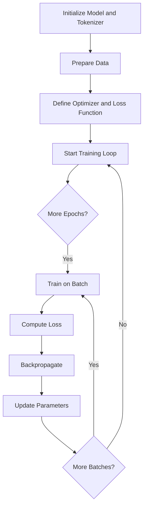
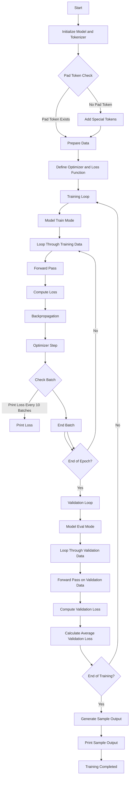

<h1 align="center">Fine Tuning</h1>

Fine-tuning a pretrained large language model involves updating all or some of its weights 
so that the model can better handle the specific data it is being 
trained on. Key processing steps involve:

- Prepare the training loop
    - Initialize a pretrained model and a tokenizer via the transformer library from Huggingface
    - Standardize the length of input sequences via padding tokens
    - Make training data availablle
    - Define the optimizer (Adaptive Moment Estimation, Adam) and the loss function (Cross-Entropy)
- Run the training loop
    - An outer for loop runs over the epocs and an innner for loop iterates over batches. Core processing tasks are carried out in the inner loop:
      input preparation, forward pass including loss calculation, resetting the optimizer's gradients to zero, backpropagation and updating the model 
      parameters via the optimizer and print out of the loss. 

Next I describe a sequence of Jupyter Notebooks which carries out fine tuning on next-token prediction. 
We start with a simple approach to fine-tuning and add more bells and whistles as we move over to more complex versions of fine-tuning. 
Each approach is illustrated by a self-explantory mermaid diagram that follows closely the Python code. 

### fine_tuning_01.ipynb
The training loop set up in fine_tuning_01.ipynb fine-tunes a pretrained model 
on a new (and very simple!) dataset. 

### Diagram for tine_tuning_01.ipynb

### fine_tuning_02.ipynb
The training loop set up in Training_Loop_01.ipynb fine-tunes a pretrained model 
on a new (and very simple!) dataset. We will now extend this example by inclduing 
a validation set to monitor overfitting and generalization.

### Diagram for fine_tuning_02.ipynb

### fine_tuning_03.ipynb
The notebook fine_tuning_03.ipynb illustrates the loss of training and the evaluation over the epochs used. 

### Diagram for fine_tuning_03.ipynb

```mermaid
graph TD
    A[Start] --> B[Import libraries and modules]
    B --> C[Initialize model and tokenizer]
    C --> D[Check and add padding token if needed]
    D --> E[Prepare training and validation data]
    E --> F[Define loss functions and optimizers]
    F --> G[Initialize losses dictionary]
    G --> H[Set training configurations]
    
    H --> I{For each combination of loss function and optimizer}
    I --> J[Reinitialize model and optimizer]
    J --> K[Ensure pad token ID is set for the model]
    K --> L[Initialize training and validation loss lists]

    L --> M[Training loop]
    M --> N[Set model to train mode]
    N --> O[Initialize total training loss]

    O --> P{For each batch in training data}
    P --> Q[Get input IDs and attention mask]
    Q --> R[Forward pass through the model]
    R --> S[Calculate loss]
    S --> T[Zero gradients]
    T --> U[Backward pass]
    U --> V[Update optimizer]
    V --> W[Accumulate training loss]

    W --> X[Calculate average training loss]
    X --> Y[Add to training losses list]

    Y --> Z[Validation loop]
    Z --> AA[Set model to eval mode]
    AA --> AB{For each batch in validation data}
    AB --> AC[Get input IDs and attention mask]
    AC --> AD[Forward pass through the model]
    AD --> AE[Calculate validation loss]
    AE --> AF[Accumulate validation loss]

    AF --> AG[Calculate average validation loss]
    AG --> AH[Add to validation losses list]
    AH --> AI[Print training and validation loss for the epoch]

    AI --> AJ[Store losses for plotting]
    AJ --> AK[Repeat for all epochs and combinations]

    AK --> AL[Plot the losses]
    AL --> AM[Generate sample output]
    AM --> AN[End]

    I --> AK[If all combinations are done]
```

