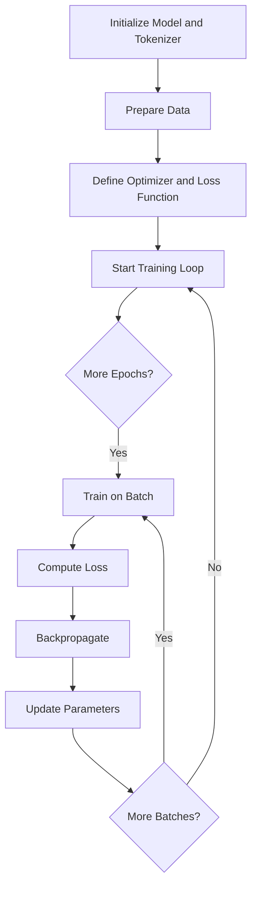
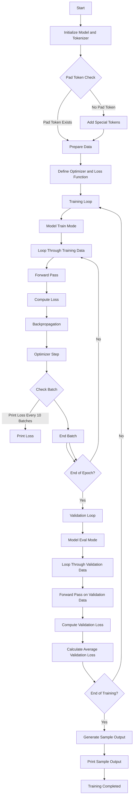

<h1 align="center">Fine Tuning</h1>

Fine-tuning a pretrained large language model involves updating its weights 
so that the model can better handle the specific data it is being 
trained on. Key processing steps involve:

- Prepare the training loop
    - Initialize a pretrained model and a tokenizer via the transformer library from Huggingface
    - Standardize the length of input sequences via padding tokens
    - Make training data availablle
    - Define the optimizer (Adaptive Moment Estimation, Adam) and the loss function (Cross-Entropy)
- Run the training loop
    - An outer for loop runs over the epocs and an innner for loop iterates over batches

Next I describe a sequence of Jupyter Notebooks which carries out fine tuning. We start with a simple approach to fine-tuning and 
add more bells and whistles in more complex version of fine-tuning

### Fine_Tuning_01.ipynb
The training loop set up in Fine_Tuning_01.ipynb fine-tunes a pretrained model 
on a new (and very simple!) dataset. 

### Diagram for Fine_Tuning_01.ipynb

### Training_Loop_02.ipynb
The training loop set up in Training_Loop_01.ipynb fine-tunes a pretrained model 
on a new (and very simple!) dataset. 

### Diagram for Training_Loop_02.ipynb

