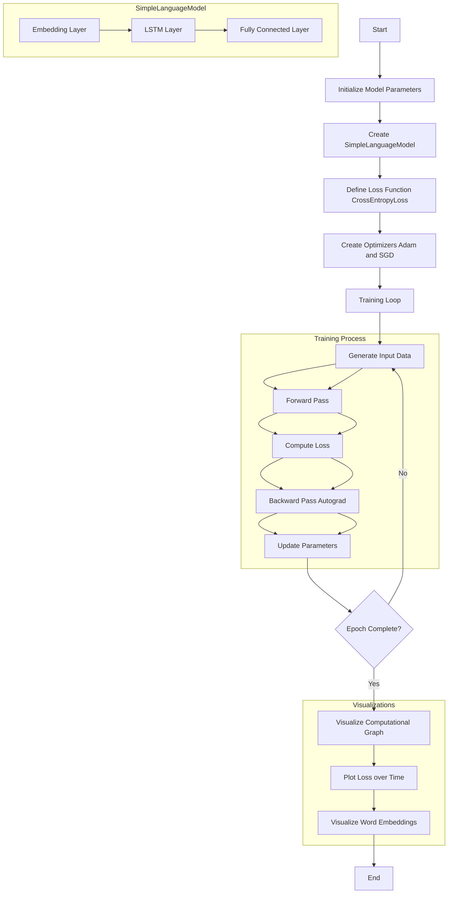

# PyTorch's automatic differentiation engine `autograd`
 `pytorch.autograd` is PyTorch's workhorse when it comes to neural network training. 
 More specifically, `pytorch.autograd` computes gradients of tensor operations, allowing for efficient backpropagation during the training process.
Below is a simple example that demonstrates the use of autograd in a context typical for language models. 
We'll create a small neural network that predicts the next word in a sequence, which is a fundamental task in language modeling:


```
