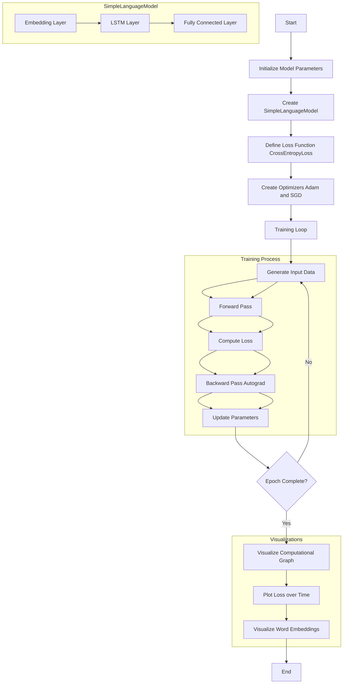

# PyTorch's automatic differentiation engine `autograd`
 `pytorch.autograd` is PyTorch's workhorse when it comes to neural network training. 
 More specifically, `pytorch.autograd` computes gradients of tensor operations, allowing for efficient backpropagation during the training process.
The chart below illustrates the code in `autograd.ipynb` where autograd is used create a small neural network that predicts the next word in a sequence, which is a fundamental task in language modeling:

The code generates three charts: 

* model_graph.png: A visualization of the model's computational graph.
* loss_plot.png: A plot showing how the loss decreases over time for both Adam and SGD optimizers.
* word_embeddings.png: A 2D visualization of the learned word embeddings.

# References
A Gentle Introduction to torch.autograd 
https://pytorch.org/tutorials/beginner/blitz/autograd_tutorial.html
