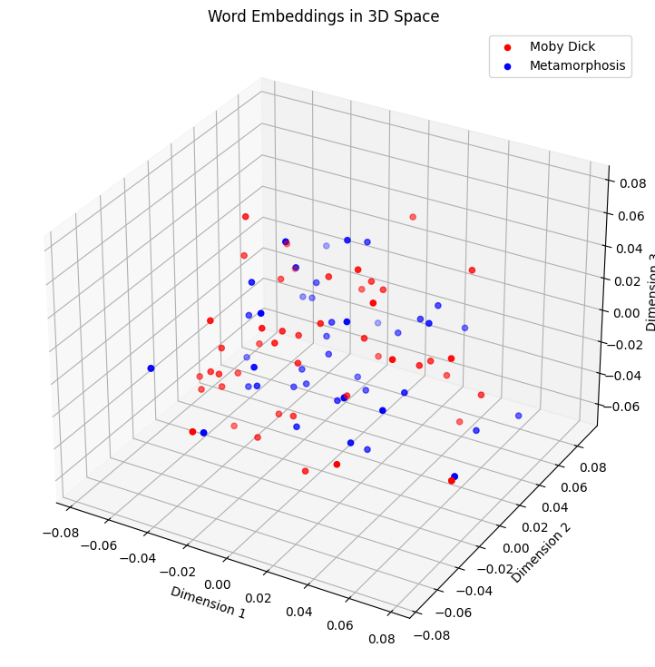

<h1 align="center">Embeddings</h1>

A scalable numeric representation of text, images sounds is key to AI. 
This is where embeddings come in. 
Typically represed via a matrix notation, the creation of  embeddings marks out  the fist step into a machine readable format. 

The Colab notebook `embeddings_01.ipynb` offers Python code to create embeddings on the basis of the first 200 words from Moby Dick by William Melville (1851) 
and Metamorphosis by Franz Kafka (1912). 

The embedding layer is a layer in a neural network model that is responsible for learning word embeddings from input text data. In the context of the provided code, the embedding layer is created using TensorFlow's Keras API with the Embedding class. This layer takes as input integer-encoded sequences (in this case, the padded documents) and converts each integer into a dense vector representation (i.e., word embedding) of fixed dimensionality. These word embeddings are learned during the training process and capture semantic relationships between words based on the context in which they appear.

The model constructed in the provided code can be characterized as a simple neural network model with an embedding layer. Specifically, it is a sequential model, meaning that the layers are stacked sequentially on top of each other. The only layer in this model is the embedding layer, which takes the integer-encoded sequences (padded documents) as input and produces word embeddings as output.

The mermain diagram below illustrates how to the embeddings are achieved in embeddings_o1.ipynb. 

### 3D Chart 
The 3 D chart below shows the word embeddings generated by embeddings_01.ipynb. 

