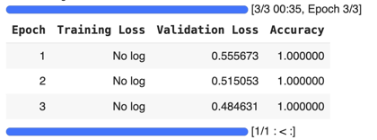

<h1 align="center">Model Evaluation</h1>

The program evaluation_01.ipynb in this folder performs fine-tuning and evaluation of a pre-trained BERT model on a custom text classification dataset (text_classification_data.csv). 
The data is available here and can be edited or extended easily. Undoubtedly, this dataset is to small for a maningful evaluation. Its purpose here is to illustrate how a pretrained LLM can be evaluated. Here’s a detailed breakdown of the what evaluation_01.ipynb does:

* Installation and Uninstallation of Dependencies:
  + The program installs necessary libraries (transformers, datasets, and evaluate).
  + It downgrades pyarrow and reinstalls cudf-cu12 and ibis-framework.

* Loading Pre-trained Model and Tokenizer:
  + Loads the bert-base-uncased model from the Hugging Face Transformers library.
  + Loads the corresponding tokenizer.

* Loading and Preparing the Dataset:
  + Reads a CSV file containing text and labels for classification.
  + Converts the pandas DataFrame to a Hugging Face Dataset.

* Preprocessing the Dataset
  + Applies tokenization and padding/truncation to the text data to prepare it for the model.

* Defining the Evaluation Metric
  + Uses the evaluate library to load the accuracy metric, which will be used to evaluate the model’s performance.

* Setting Up Training Arguments
  + Defines training parameters such as the output directory, number of epochs, batch sizes, and evaluation strategy.

* Splitting the Dataset
  + Splits the dataset into training and testing sets (80-20 split).

* Training the Model:
  + Uses the Trainer class from the Transformers library to handle the training loop, evaluation, and logging.
  + Trains the model for the specified number of epochs.

* Evaluating the Model
  + Evaluates the trained model on the test set and prints the evaluation results.

- **Imports and Initialization**
  - The program imports necessary libraries: `torch`, `torch.nn`, `torch.optim`, and `matplotlib.pyplot`.
  - It defines a custom `LoRALayer` class, which implements the Low-Rank Adaptation (LoRA) mechanism by decomposing the weight matrix into two lower-rank matrices (Hu et al. (2021, p. 4).
  - A `SimpleModel` class is defined, which uses either a regular linear layer or a LoRA layer depending on the provided rank.

- **Data Preparation**
  - Dummy input and target data are generated using random tensors. The input dimension is set to 10 and the output dimension to 5.

- **Training and Evaluation Functions**
  - `train_model` function: This trains a given model using Mean Squared Error (MSE) loss and Adam optimizer for a specified number of epochs.
    It returns the list of training losses.
  - `evaluate_model` function: This evaluates the model on test inputs and prints the predictions.

- **Model Training Without LoRA**
  - A simple linear model without LoRA is trained using the dummy data, and the training losses are stored.

- **Model Training With LoRA**
  - The program trains separate models with LoRA ranks 1, 2, 3, and 4. Each model's training losses are stored.

- **Loss Plotting**
  - The program plots the training losses for all models (with and without LoRA) for comparison.

- **Evaluation**
  - Finally, the program evaluates and prints predictions from the trained models (with and without LoRA) using new test inputs.

### Evaluation
The evaluation results are shown in the Figure below. 
Not unexpectedly, there is a perfect accuracy (1.0) suggesting that the model might be overfitting to the training data which is a like consequence of the small evaluation set used. 

  

