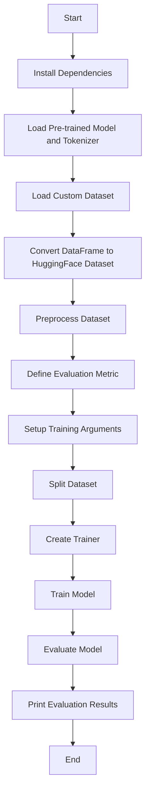
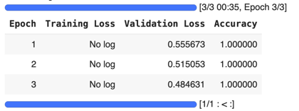

<h1 align="center">Model Evaluation (i) </h1>

The program evaluation_01.ipynb in this folder performs fine-tuning and evaluation of a pre-trained BERT model on a custom text binary classification dataset (text_classification_data.csv). 
Accuracy is used as an evalution metrics. The data is available here and can be edited or extended easily. Clearly, the dataset is too small for a maningful evaluation. Its purpose here is to illustrate how a pretrained LLM can be evaluated. Here’s a detailed breakdown of the what evaluation_01.ipynb does:

* Installation and Uninstallation of Dependencies:
  + The program installs necessary libraries (transformers, datasets, and evaluate).
  + It downgrades pyarrow and reinstalls cudf-cu12 and ibis-framework.

* Loading Pre-trained Model and Tokenizer:
  + Loads the bert-base-uncased model from the Hugging Face Transformers library.
  + Loads the corresponding tokenizer.

* Loading and Preparing the Dataset:
  + Reads a CSV file containing text and labels for classification.
  + Converts the pandas DataFrame to a Hugging Face Dataset.

* Preprocessing the Dataset
  + Applies tokenization and padding/truncation to the text data to prepare it for the model.

* Defining the Evaluation Metric
  + Uses the evaluate library to load the accuracy metric, which will be used to evaluate the model’s performance.

* Setting Up Training Arguments
  + Defines training parameters such as the output directory, number of epochs, batch sizes, and evaluation strategy.

* Splitting the Dataset
  + Splits the dataset into training and testing sets (80-20 split).

* Training the Model:
  + Uses the Trainer class from the Transformers library to handle the training loop, evaluation, and logging.
  + Trains the model for the specified number of epochs which is set to 3.  

* Evaluating the Model
  + Evaluates the trained model on the test set and prints the evaluation results.

### Diagram for embeddings_01.ipynb

### Evaluation
The evaluation results are shown in the Figure below. 
Not unexpectedly, there is a perfect accuracy (1.0) suggesting that the model might be overfitting to the training data which is a likely consequence of the small evaluation set used. 

  

