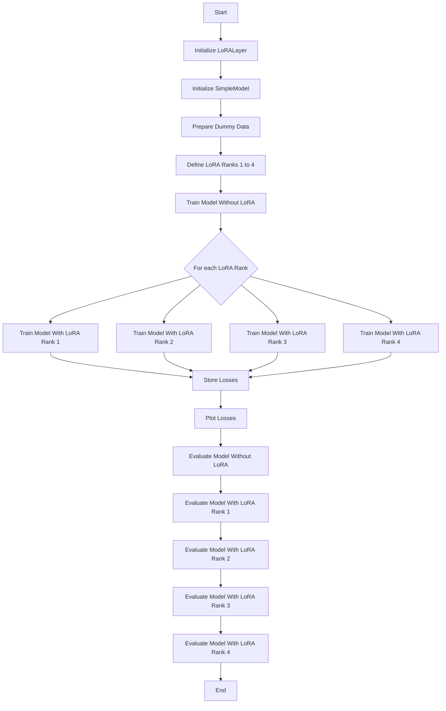

<h1 align="center">Pinecone Vector Database </h1>

Vector databases are important building blocks for setting up large language models. 

Vector databases differ from traditional relational databases, which are intended to store tabular data. 
They also contrast with modern NoSQL databases like MongoDB that store data in JSON format. 
Vector databases are uniquely designed to store and retrieve one specific type of data: vector embeddings.

Next we are looking into the vector database _Pinecone_ currently the most popular vector database. 
We make use of a free plan installation of Pinecone to get a practical understanding how a vector database 
carries tasks like semantic search or work as a long term memory for large language models. 

To run this example a Pinecone API is required that is obtained upon registration, e.g., for a free plan. 
The free plan of Pinecone support a single index and project. 

## Semantic Search
The example spelled out in pinecone_01.ipynb shows how a vector database can be used for searching vectors similar to a query vector
In a nutshell, the codes sets up a small vector database with 3D vectors, retrieves vectors similar to a query vector and illustrate the vectors in general and the query vector and similar vectors. 
While the example is simple, it does harness essential steps when working with Pinecone. 

With serverless indexes, you don’t configure or manage any compute or storage resources.
On the free Starter plan, you can create serverless indexes in the us-east-1 region of AWS only.
The cloud and region cannot be changed after a serverless index is created.

Your current code usage should fall within the scope of the free plan if you're only performing basic operations like creating an index, upserting a small number of vectors, and running a few queries. However, if you exceed the limits of the free plan (e.g., by creating multiple large indexes or performing many operations), you might incur charges.

To get detailed information about your current usage and limits, you can check your Pinecone account dashboard. If you have any concerns about potential costs, it is always a good idea to monitor your usage and refer to Pinecone's pricing documentation.


https://docs.pinecone.io/guides/indexes/understanding-indexes


Fine-tuning is essential for adapting a pretrained large language model (LLM) to perform specific tasks effectively. However, fine-tuning large-scale models, which involves updating billions of parameters, is highly demanding in terms of memory and time. To address this, parameter-efficient fine-tuning (PEFT) methods have been developed. These methods reduce the memory and execution time required for full parameter fine-tuning while maintaining model quality.

A notable PEFT method is Low-Rank Adaptation (LoRA) by Hu et al. (2021). LoRA addresses the challenges of full-parameter fine-tuning by updating only two smaller, lower-rank matrices instead of the original large weight matrix. 
The final weights are obtained by adding the LoRA-adapted weights to the original matrix. LoRA has set a paradigm for efficient fine-tuning, inspiring numerous variations. 

The Colab notebook `LoRa_01.ipynb` introduces a simple way to carry out Low-Rank Adaptation using dummy data. It trains and evaluates models with and without Low-Rank Adaptation for ranks 1 to 4, plots the training losses for comparison, and prints sample predictions to illustrate the effect of different LoRA ranks.

A weight matrix in the context of LLMs is usually denoted as $W \in \mathbb{R}^{m \times n}$. 
In our example, the weight matrix is $W \in \mathbb{R}^{10 \times 5}$ which is simply a $10 \times 5$ matrix of real numbers. 
Its full rank $d$ is $\min(10, 5) = 5$. 
The question that this example program seeks to answer is whether a lower-rank adaptation of the weight matrix will result in approximately equal performance compared to the full rank. Against this background, the program can be described as follows:

- **Imports and Initialization**
  - The program imports necessary libraries: `torch`, `torch.nn`, `torch.optim`, and `matplotlib.pyplot`.
  - It defines a custom `LoRALayer` class, which implements the Low-Rank Adaptation (LoRA) mechanism by decomposing the weight matrix into two lower-rank matrices (Hu et al. (2021, p. 4).
  - A `SimpleModel` class is defined, which uses either a regular linear layer or a LoRA layer depending on the provided rank.

- **Data Preparation**
  - Dummy input and target data are generated using random tensors. The input dimension is set to 10 and the output dimension to 5.

- **Training and Evaluation Functions**
  - `train_model` function: This trains a given model using Mean Squared Error (MSE) loss and Adam optimizer for a specified number of epochs.
    It returns the list of training losses.
  - `evaluate_model` function: This evaluates the model on test inputs and prints the predictions.

- **Model Training Without LoRA**
  - A simple linear model without LoRA is trained using the dummy data, and the training losses are stored.

- **Model Training With LoRA**
  - The program trains separate models with LoRA ranks 1, 2, 3, and 4. Each model's training losses are stored.

- **Loss Plotting**
  - The program plots the training losses for all models (with and without LoRA) for comparison.

- **Evaluation**
  - Finally, the program evaluates and prints predictions from the trained models (with and without LoRA) using new test inputs.


### Evaluation
The evaluation results are shown in the Figure below. 
It shows that low-rank matrices can approximate the full rank matrix of weights reasonably well or even good. 
However, a combination of a small number of epochs and a very low value for r is most likely to lead to a reduced model quality. 


### Diagram for embeddings_01.ipynb




### Example of a full rank matrix (d=5) and the low-rank matrices A and B (r=4)

Full-rank weight matrix (W): 
````{verbatim}
tensor([[-0.0448,  0.2058, -0.0281,  0.0376,  0.0584,  0.1400, -0.2718, -0.2713,  0.3039,  0.1259],
        [-0.2664, -0.1778, -0.1396,  0.1138, -0.0749,  0.3648, -0.2606,  0.5835,  0.2209, -0.2050],
        [ 0.0892,  0.2565,  0.1543, -0.0356, -0.0429,  0.4232, -0.0238,  0.1769,  0.0168,  0.0441],
        [ 0.2019,  0.0651, -0.0648,  0.0958,  0.1941, -0.1589, -0.0211,  0.0678,  0.2127, -0.0174],
        [ 0.0487, -0.0314,  0.2424,  0.3472, -0.1243, -0.1546,  0.2496,  0.3454,  0.0283, -0.1404]])

Low-rank weight matrix A:

tensor([[ 0.1320,  0.0891, -0.0908, -0.0657,  0.1354, -0.3377, -0.0904, -0.0050,  0.2353,  0.4216],
        [ 0.4328,  0.1273, -0.1969,  0.1918,  0.1469,  0.2975, -0.3079, -0.3059,  -0.3676, -0.1955],
        [ 0.4405,  0.1213, -0.1199,  0.3663,  0.0338,  0.2299, -0.0117,  0.1059,  -0.3072, -0.1316],
        [ 0.3890,  0.2118, -0.1320,  0.3370,  0.0558,  0.1938, -0.0376, -0.2561,  -0.3457, -0.0760]])

Low-rank weight matrix B:

tensor([[ 0.3414, -0.2377, -0.2392, -0.2219],
        [-0.2382,  0.3772,  0.1774, -0.0076],
        [-0.0715,  0.2588,  0.2680,  0.2750],
        [ 0.1021,  0.3189,  0.3937,  0.3194],
        [-0.1458, -0.3615, -0.0903, -0.2763]])
````


## References

Pinecone (2024a). Opening up our free plan
https://www.pinecone.io/blog/updated-free-plan/#Updates-to-the-free-plan
