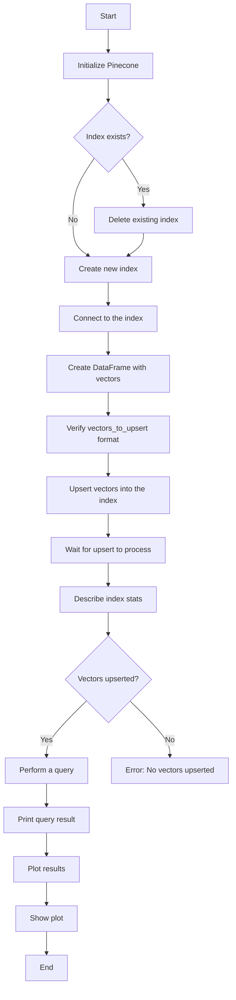

<h1 align="center">Pinecone Vector Database </h1>

Vector databases are important building blocks for setting up large language models. 
While traditional relational databases are designed for tabular data and  NoSQL databases like MongoDB store data in JSON format, vector databases are specialized for handling any kind of data via vector embeddings.

Next we are looking into the vector database _Pinecone_ which is currently the most popular vector database. 
To get a practical understanding how a vector database carries tasks like semantic search or work as a long term memory for large language models, we make use of the free starter plan installation of Pinecone (Pinecone, 2024a).
A Pinecone API key is obtained upon registration, e.g., for a free plan to run the code described here. 
The free plan of Pinecone supports a single index and project. 

The code works with a serverless index which is an indexing system that operates without the need for users to manage or provision servers explicitly. 
On the free Starter plan, user can create serverless indexes in the us-east-1 region of AWS only.
The cloud and region cannot be changed after a serverless index is created.

The code usage  remains within the scope of the free plan if only  basic operations like creating an index, upserting a small number of vectors, and running a few queries are performed. 
To get detailed information about your personal current usage and limits, you can check your Pinecone account dashboard. 
In case of concerns about potential costs, it is always a good idea to monitor the usage and refer to Pinecone's pricing documentation.

## Semantic Search
The simple example spelled out in pinecone_01.ipynb shows how a vector database can be used for searching vectors which are found to be similar to a query vector. 
Considering that in Pinecon the max vector dimensionality is 20,000, the example is extremly simple. 
It procees on the basis of 3D vectors which allow for a 3D visualization. 
In a nutshell, the code sets up a small vector database with 3D vectors, retrieves vectors similar to a query vector and illustrate the vectors in general and the query vector and similar vectors. 
While the example is simple and it deliberately does not relate to LLMs to focus on the essential steps when working with Pinecone. 

## Mermaid Diagram 
The diagram below that illustrates how the code in pinecone_01.ipynb works. 
Pinecone is initialized, any existing index is deleted and a new one created. 
Then the programm creates a DataFrame with vectors, upserts them into the Pinecone index, and checks the index stats. 
A query vector is defined, and the index is queried for similar vectors. The results are plotted in 3D, displaying original vectors, the query vector, and close vectors based on a defined similarity threshold.

### Charts Produced by pinecone_01.ipynb
The code produces two charts. On the left hand side  gives an idea of the simple collection of 3D vectors used. 
The right hand side shows the query vector and the vectors found to be similar with it. 
Pinecode allows for similarity calcution via different metrics: euclidean/manhattan/dotproduct/cosine. 
The code makes use of euclidean similarity. 

## References

Pinecone (2024a). Opening up our free plan
https://www.pinecone.io/blog/updated-free-plan/#Updates-to-the-free-plan
