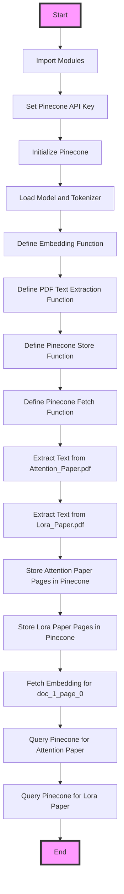

<h1 align="center">Query-Document Matching Using Pinecone</h1>
The provided code is a script that initializes a Pinecone index, extracts text from PDF documents, and stores each page of the PDFs as separate vectors in the Pinecone index. 
Two seminal papers of LLMs were harnessed used as play material. 

* The "Lora Paper": Hu, E. J., Shen, Y., Wallis, P., Allen-Zhu, Z., Li, Y., Wang, S., Wang, L. & Chen, W. (2021). Lora: Low-rank adaptation of large language models. arXiv preprint arXiv:2106.09685.
* The "Attention Paper": Vaswani, A., Shazeer, N., Parmar, N., Uszkoreit, J., Jones, L., Gomez, A. N., & Polosukhin, I. (2017). Attention is all you need. Advances in neural information processing systems, 30.

The code makes use of the Hugging Face sentence-transformers/all-MiniLM-L6-v2 model used purely as an embedding model to generate vector representations of text. 
The embeddings are then stored in Pinecone to be used for querying. 
The script also includes functions to fetch  embeddings from Pinecone and to query the index for relevant document pages.

## Query-Documentpage Similarity
The example in pinecone_02.ipynb shows how a vector database can be used for searching vectors (single pages from the documents listed above) similar to a query vector. 

## Mermaid Diagram 
The diagram below illustrates how the code in pinecone_01.ipynb works. Pinecone is initialized, any existing index is deleted, and a new one is created. 
The program then creates a DataFrame with vectors, upserts them into the Pinecone index, and checks the index stats. A query vector is defined, and the index is queried for similar vectors. 
The results are plotted in 3D, displaying original vectors, the query vector, and similar vectors based on a defined similarity threshold.

