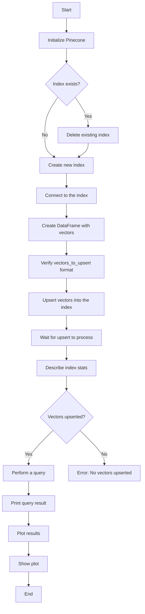
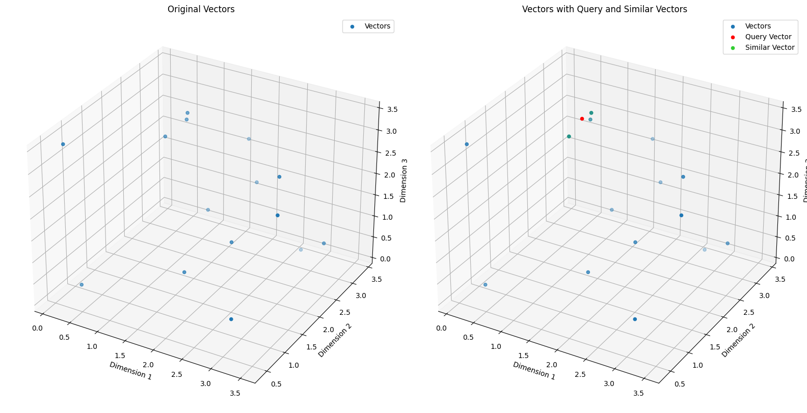

<h1 align="center">Pinecone Vector Database</h1>
Vector databases are crucial for setting up large language models. 
Unlike traditional relational databases designed for tabular data or NoSQL databases like MongoDB that store data in JSON format, vector databases specialize in handling data via vector embeddings.

We will explore the Pinecone vector database, currently the most popular. 
To understand how a vector database performs tasks like semantic search or functions as a long-term memory for large language models, we'll use Pinecone's free starter plan (Pinecone, 2024a). 
A Pinecone API key, obtainable upon registration, is required to run the code described here. The free plan supports a single index and project.

The code uses a serverless index, an indexing system that operates without users managing or provisioning servers. 
On the free Starter plan, users can create serverless indexes only in the us-east-1 region of AWS. The cloud and region cannot be changed after a serverless index is created.

The code remains within the scope of the free plan if only basic operations like creating an index, upserting a small number of vectors, and running a few queries are performed. For detailed information about your current usage and limits, check your Pinecone account dashboard. If you have concerns about potential costs, monitor your usage and refer to Pinecone's pricing documentation.

## Semantic Search
The example in pinecone_01.ipynb shows how a vector database can be used for searching vectors similar to a query vector. 
Given that Pinecone allows a max vector dimensionality of 20,000, the example is extremely simple, using 3D vectors for visualization. 
The code sets up a small vector database with 3D vectors, retrieves vectors similar to a query vector, and illustrates both the general vectors and the query and similar vectors. 
This example is designed to focus on the essential steps when working with Pinecone, deliberately not relating to LLMs.

## Mermaid Diagram 
The diagram below illustrates how the code in pinecone_01.ipynb works. Pinecone is initialized, any existing index is deleted, and a new one is created. 
The program then creates a DataFrame with vectors, upserts them into the Pinecone index, and checks the index stats. A query vector is defined, and the index is queried for similar vectors. 
The results are plotted in 3D, displaying original vectors, the query vector, and similar vectors based on a defined similarity threshold.

### Charts Produced by pinecone_01.ipynb
The code creates two charts. 
The chart on the left illustrates the simple collection of 3D vectors used. 
The right chart shows the query vector and the vectors found to be similar to it. 
Pinecone allows for similarity calculation using different metrics: Euclidean, Manhattan, Dot Product, and Cosine. 
This example uses Euclidean similarity.

## References

Pinecone (2024a). Opening up our free plan
https://www.pinecone.io/blog/updated-free-plan/#Updates-to-the-free-plan
