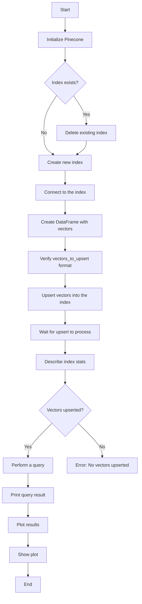

<h1 align="center">Query-Document Matching Using Pinecone</h1>
The provided code is a script that initializes a Pinecone index, extracts text from PDF documents, and stores each page of the PDFs as separate vectors in the Pinecone index. 
Two seminal papers of LLMs were harnessed used as play material. 

* The "Lora Paper": Hu, E. J., Shen, Y., Wallis, P., Allen-Zhu, Z., Li, Y., Wang, S., Wang, L. & Chen, W. (2021). Lora: Low-rank adaptation of large language models. arXiv preprint arXiv:2106.09685.
* The "Attention Paper": Vaswani, A., Shazeer, N., Parmar, N., Uszkoreit, J., Jones, L., Gomez, A. N., ... & Polosukhin, I. (2017). Attention is all you need. Advances in neural information processing systems, 30.

The code makes use of the Hugging Face sentence-transformers/all-MiniLM-L6-v2 model to convert the text into embeddings. The script also includes functions to fetch these embeddings from Pinecone and to query the index for relevant documents based on query embeddings.

## Semantic Search
The example in pinecone_01.ipynb shows how a vector database can be used for searching vectors similar to a query vector. 
Given that Pinecone allows a max vector dimensionality of 20,000, the example is extremely simple, using 3D vectors for visualization. 
The code sets up a small vector database with 3D vectors, retrieves vectors similar to a query vector, and illustrates both the general vectors and the query and similar vectors. 
This example is designed to focus on the essential steps when working with Pinecone, deliberately not relating to LLMs.

## Mermaid Diagram 
The diagram below illustrates how the code in pinecone_01.ipynb works. Pinecone is initialized, any existing index is deleted, and a new one is created. 
The program then creates a DataFrame with vectors, upserts them into the Pinecone index, and checks the index stats. A query vector is defined, and the index is queried for similar vectors. 
The results are plotted in 3D, displaying original vectors, the query vector, and similar vectors based on a defined similarity threshold.

### Charts Produced by pinecone_01.ipynb
The code creates two charts. 
The chart on the left illustrates the simple collection of 3D vectors used. 
The right chart shows the query vector and the vectors found to be similar to it. 
Pinecone allows for similarity calculation using different metrics: Euclidean, Manhattan, Dot Product, and Cosine. 
This example uses Euclidean similarity.

## References

Pinecone (2024a). Opening up our free plan
https://www.pinecone.io/blog/updated-free-plan/#Updates-to-the-free-plan
